<!-- animated contribution graph: real data, boxes reveal cell by cell
     (regenerated daily by .github/workflows/update-profile-art.yml) -->

<h3><code>utkarsh@github ~ $ ./contributions.sh</code></h3>

 
 

<!-- hero: monochrome ASCII portrait (types in) beside a neofetch-style card.
     widths add up to the graph's 860 and both panels land at the same height.
     portrait: drop a photo at ./source-photo.jpg and the workflow rebuilds it
     card:     python scripts/make_info_card.py -->

<h3><code>utkarsh@github ~ $ whoami</code></h3>

<table>
<tr>
<td valign="top"></td>
<td valign="top"></td>
</tr>
</table>

 
 

<h3><code>utkarsh@github ~ $ cat about.txt</code></h3>

<b>AI/ML Developer · Computer Vision · Full-Stack Builder</b>

I build applied AI projects with a developer mindset: train the model, shape the API, wire the frontend, and make the whole system feel complete. My main interest is computer vision, especially projects that move beyond notebooks into clean, testable applications.

| Vision | Systems | Delivery |
| :---: | :---: | :---: |
| Satellite image super-resolution | ML APIs with FastAPI | React interfaces for demos |
| Deep learning experimentation | Structured backend pipelines | Practical deployment workflow |
| Applied AI problem solving | End-to-end project architecture | Portfolio-ready builds |

 

<h3><code>utkarsh@github ~ $ ls ~/projects</code></h3>

| Project | What it shows | Stack |
| --- | --- | --- |
| [satellite-srcnn](https://github.com/Awasthiutk564/satellite-srcnn) | Deep learning-based super-resolution for satellite imaging systems | Python |
| [student-health-model](https://github.com/Awasthiutk564/student-health-model) | Model comparison, confusion matrices, and project-level ML reporting | Python |
| [Sudoku-DFS-Visualizer-C](https://github.com/Awasthiutk564/Sudoku-DFS-Visualizer-C) | DFS and backtracking visualized through a C-based Sudoku solver | C |

 

<h3><code>utkarsh@github ~ $ ./stack.sh</code></h3>

 
 

<h3><code>utkarsh@github ~ $ ./links.sh</code></h3>

 

